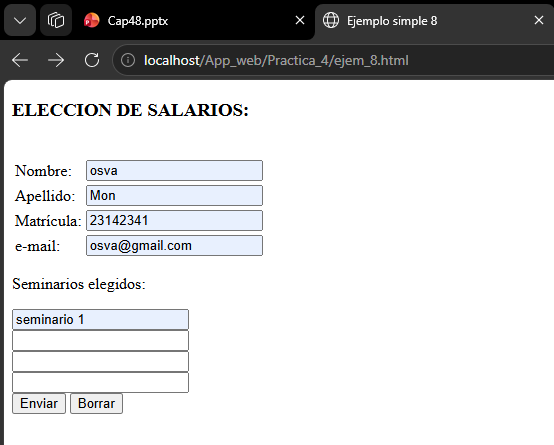
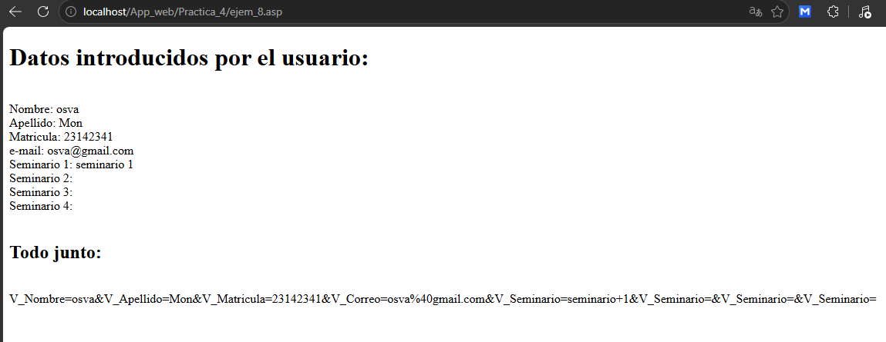
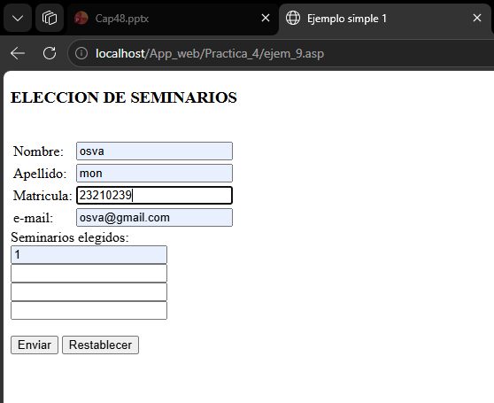
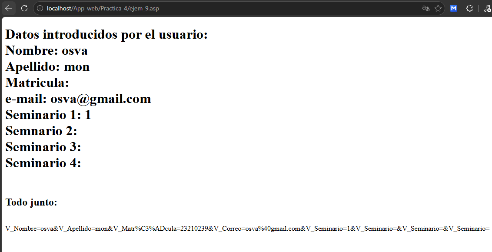
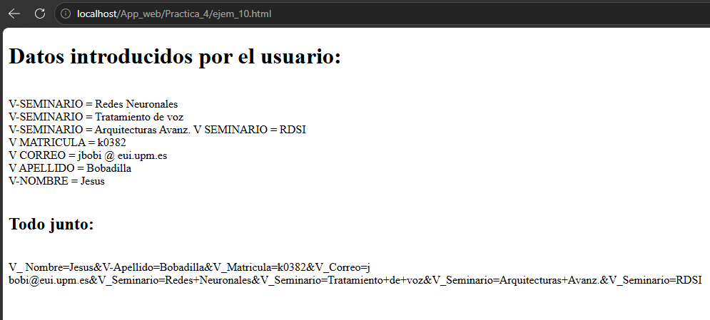
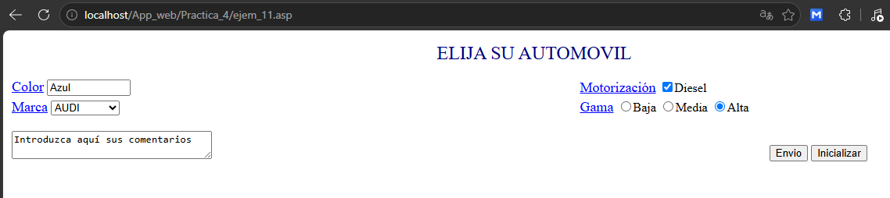
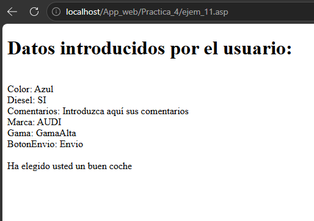

# Reporte - Práctica 4: ASP Clásico - Formularios y Request.Form

---

**ASIGNATURA:**  
Desarrollo de Aplicaciones Web

**DOCENTE:**  
EUGENIA ERICA VERA CERVANTES

**ALUMNO:**  
MONTEALEGRE NAHUACATL, OSVALDO 

**FECHA DE ENTREGA:**  
Lunes, 16 de junio de 2026

---


## Introducción

Se presentan cuatro ejemplos (del 8 al 11) que incrementan en complejidad: desde un formulario que envía datos a una página ASP separada, hasta un formulario autoprocesado en una sola página con validación condicional y múltiples tipos de controles HTML (texto, checkbox, select, radio, textarea). Cada ejemplo cuenta con su archivo `.asp` y, cuando aplica, su correspondiente `.html` estático mostrando la salida renderizada.

El objetivo principal es comprender cómo ASP captura y procesa los datos enviados por el usuario mediante el método POST y el objeto `Request.Form`.

---

## Entorno y requisitos

Para visualizar y ejecutar correctamente los archivos de esta práctica se requiere lo siguiente:

- **Sistema operativo:** Windows 10/11 o Windows Server con IIS (Internet Information Services) instalado y habilitado.
- **IIS con ASP Clásico:** El rol de servidor web debe tener habilitado ASP (Active Server Pages) en las características de IIS.
- **Navegador web:** Cualquier navegador moderno (Chrome, Edge, Firefox) para solicitar las páginas ASP a través de HTTP.
- **Ubicación de los archivos:** Los archivos `.asp` y `.html` deben colocarse en el directorio raíz del sitio web (por defecto `C:\inetpub\wwwroot\`) o en una subcarpeta dentro de este.
- **Permisos:** El directorio del sitio debe tener permisos de lectura para el usuario `IUSR` (IIS Anonymous User).
- **Editor de código:** Recomendable usar un editor como VS Code, Notepad++ o Bloc de notas para revisar y modificar el código fuente.

---

## Ejecución

Para ejecutar los ejemplos de esta práctica siga estos pasos:

1. Asegúrese de que IIS esté instalado y en ejecución en su equipo Windows.
2. Copie todos los archivos `.asp` y `.html` de la práctica al directorio raíz del sitio web (`C:\inetpub\wwwroot\App_web\`).
3. Abra un navegador web y acceda a la siguiente URL:
   - `http://localhost/App_web/ejem_8.asp` (para el primer ejemplo)
   - Cambie el número del archivo para acceder a los demás ejemplos (ejem_9.asp, ejem_10.asp, ejem_11.asp).
4. Para los ejemplos que incluyen formularios (8, 9, 10 y 11), complete los campos y presione "Enviar" para ver el procesamiento de datos en ASP.
5. Si desea modificar algún ejemplo, edite el archivo `.asp` correspondiente con un editor de texto y guarde los cambios; luego recargue la página en el navegador para ver el resultado actualizado.

---

## Ejemplo 8: Formulario con procesamiento separado

**Archivo:** `ejem_8.asp`

El formulario HTML se define en `ejem_8.html` y envía los datos mediante POST a `ejem_8.asp`. La página ASP recibe los campos y los muestra utilizando `Request.Form("nombre_campo")`.

**Formulario (`ejem_8.html`):**

```html
<!DOCTYPE html>
<html lang="en">
<head>
    <meta charset="UTF-8">
    <meta name="viewport" content="width=device-width, initial-scale=1.0">
    <title>Ejemplo simple 8</title>
</head>
<BODY>
    <H3>ELECCION DE SALARIOS:</H3><BR>
    <FORM ACTION="ejem_8.asp" METHOD="POST">
        <table>
            <tr><td>Nombre:</td><td><input name="V_Nombre"></td></tr>
            <tr><td>Apellido:</td><td><input name="V_Apellido"></td></tr>
            <tr><td>Matrícula:</td><td><input name="V_Matricula"></td></tr>
            <tr><td>e-mail:</td><td><input name="V_Correo"></td></tr>
        </table>
        
        <p>Seminarios elegidos:</p>
        <input name="V_Seminario"><br>
        <input name="V_Seminario"><br>
        <input name="V_Seminario"><br>
        <input name="V_Seminario"><br>
        
        <input type="submit" value="Enviar">
        <input type="reset" value="Borrar">
    </FORM>
 </BODY>
</html>
```

**Procesamiento ASP (`ejem_8.asp`):**

```asp
<!DOCTYPE html>
<html lang="en">
<head>
    <meta charset="UTF-8">
    <meta name="viewport" content="width=device-width, initial-scale=1.0">
    <title>Ejemplo simple 8</title>
</head>
<body>
    <H1> Datos introducidos por el usuario: </H1> <BR> Nombre:
    <%=Request.Form("V_Nombre")%><BR> Apellido: 
    <%=Request.Form("V_Apellido")%><BR> Matricula: 
    <%=Request.Form("V_Matricula")%><BR> e-mail:
    <%=Request.Form("V_Correo")%><BR> 

    Seminario 1: <%=Split(Request.Form("V_Seminario"), ",")(0)%><BR>
    Seminario 2: <%=Split(Request.Form("V_Seminario"), ",")(1)%><BR>
    Seminario 3: <%=Split(Request.Form("V_Seminario"), ",")(2)%><BR>
    Seminario 4: <%=Split(Request.Form("V_Seminario"), ",")(3)%><BR>
    <BR><H2> Todo junto: </H2><BR>
    <%=Request.Form%><BR><BR>
        
</body>
</html>
```

**Explicación:** El formulario envía los datos mediante POST. En `ejem_8.asp`, `Request.Form("V_Nombre")` recupera el valor de cada campo. La función `Split()` separa los valores del campo `V_Seminario` (que tiene múltiples entradas con el mismo nombre) usando la coma como delimitador. `Request.Form` sin argumentos muestra todos los datos en formato de query string.

---

## Ejemplo 9: Formulario autoprocesado (una sola página)

**Archivo:** `ejem_9.asp`

En este ejemplo, la misma página `.asp` contiene tanto el formulario como el procesamiento, utilizando un condicional `IF Request.Form="" THEN` para mostrar el formulario cuando no se han enviado datos y los resultados cuando sí.

```asp
<!DOCTYPE html>
<html lang="en">
<head>
    <meta charset="UTF-8">
    <meta name="viewport" content="width=device-width, initial-scale=1.0">
    <title>Ejemplo simple 1</title>
</head>
<body>
    <% IF Request. Form="" THEN %>
        <H3> ELECCION DE SEMINARIOS </H3><BR>
        <FORM ACTION= "ejem_9.asp" METHOD=POST>

        <TABLE><TR>
        <TD> Nombre:</TD> <TD><INPUT NAME="V_Nombre"></TD></TR>
        <TD> Apellido:</TD> <TD><INPUT NAME="V_Apellido"></TD></TR>
        <TD> Matricula:</TD> <TD><INPUT NAME="V_Matrícula"></TD></TR>
        <TD> e-mail:</TD> <TD><INPUT NAME="V_Correo"></TD></TR>
            </TABLE>
                Seminarios elegidos:<BR>
                <INPUT NAME="V_Seminario"><BR>
                <INPUT NAME="V_Seminario"><BR>
                <INPUT NAME="V_Seminario"><BR>
                <INPUT NAME="V_Seminario"><BR><BR>
                <INPUT TYPE=SUBMIT>
                <INPUT TYPE=RESET>
            </FORM>
    <% ELSE %>
        <H1> Datos introducidos por el usuario: </HI> <BR>
        Nombre: <%=Request.Form("V_Nombre")%><BR>
        Apellido: <%=Request.Form("V_Apellido")%><BR>
        Matricula: <%=Request.Form("V_Matricula")%><BR>
        e-mail: <%=Request.Form("V_Correo")%><BR>
        Seminario 1: <%=Request.Form("V_Seminario")(1)%><BR>
        Semnario 2: <%=Request.Form("V_Seminario")(2)%><BR>
        Seminario 3: <%=Request.Form("V_Seminario")(3)%><BR>
        Seminario 4: <%=Request.Form("V_Seminario")(4)%><BR>
        <BR><H2> Todo junto: </H2><BR>
        <%=Request.Form%><BR><BR>
    <% END IF %>   

</body>
</html>
```

**Explicación:** La condición `IF Request.Form="" THEN` verifica si el formulario ha sido enviado. En la primera carga (sin datos), la colección `Request.Form` está vacía, por lo que se muestra el formulario. Al presionar "Enviar", `Request.Form` contiene datos, por lo que se ejecuta la rama `ELSE` mostrando los valores ingresados. Los campos con nombre repetido (`V_Seminario`) se acceden mediante índice numérico: `Request.Form("V_Seminario")(1)`, `(2)`, etc.

---

## Ejemplo 10: Recorrido dinámico con FOR EACH

**Archivo:** `ejem_10.asp`

Se introduce el bucle `FOR EACH...NEXT` para recorrer dinámicamente todos los campos enviados en el formulario, sin necesidad de conocer sus nombres de antemano.

```asp
<!DOCTYPE html>
<html lang="en">
<head>
    <meta charset="UTF-8">
    <meta name="viewport" content="width=device-width, initial-scale=1.0">
    <title>Ejemplo simple 10</title>
</head>
<body>
    <H1> Datos introducidos por el usuario:</H1><BR>
    <% for each V_Entrada in Request.Form
        for Indice=1 to Request.Form(V_Entrada).Count %>
    <%=V_Entrada%> =
    <%=Request.Form(V-Entrada)(Indice)%><BR>
    <%next
    next %>
    <BR><H2> Todo junto: </H2><BR>
    <%=Request.Form%><BR><BR>
</body>
</html>
```

**Archivo de salida:** `ejem_10.html`

```html
<!DOCTYPE html>
<html lang="en">
<head>
    <meta charset="UTF-8">
    <meta name="viewport" content="width=device-width, initial-scale=1.0">
    <title>Ejemplo simple 10</title>
</head>
<body>
    <H1> Datos introducidos por el usuario: </H1> <BR>
    V-SEMINARIO = Redes Neuronales<BR>
    V-SEMINARIO = Tratamiento de voz<BR>
    V-SEMINARIO = Arquitecturas Avanz.<M>
    V SEMINARIO = RDSI<BR>
    V MATRICULA = k0382<BR>
    V CORREO = jbobi @ eui.upm.es<BR>
    V APELLIDO = Bobadilla<BR>
    V-NOMBRE = Jesus<BR>
    <BR><H2> Todo junto: </H2><BR>
    V_ Nombre=Jesus&V-Apellido=Bobadilla&V_Matricula=k0382&V_Correo=j
    bobi@eui.upm.es&V_Seminario=Redes+Neuronales&V_Seminario=Tratamiento+de+voz&V_Seminario=Arquitecturas+Avanz.&V_Seminario=RDSI
</body>
</html>
```

**Explicación:** `FOR EACH V_Entrada IN Request.Form` itera sobre cada clave (nombre de campo) en la colección `Request.Form`. Para cada campo, un bucle `FOR Indice=1 TO Request.Form(V_Entrada).Count` recorre todos los valores asociados a ese nombre (útil para campos repetidos como `V_Seminario`). Esto permite procesar formularios de manera genérica sin hardcodear los nombres de los campos.

---

## Ejemplo 11: Formulario completo con validación condicional

**Archivo:** `ejem_11.asp`

El ejemplo más completo: un formulario con diversos tipos de controles (texto, checkbox, select, radio, textarea) y una validación condicional que muestra un mensaje especial si se selecciona AUDI con motor Diesel.

```asp
<%@ Language="VBScript" %>
<!DOCTYPE html>
<html lang="en">
<head>
    <meta charset="UTF-8">
    <title>Ejemplo simple 11 </title>
</head>
<body bgcolor="#FFFFFF"> 
    <% If Request.Form.Count = 0 Then %>   
        <p align="center">
        <font color="#000080" size="5">ELIJA SU AUTOMOVIL</font>  
        </p>
        <form method="POST" action="ejem_11.asp">
        <table width="100%">
        <tr> <td> <font color="Blue" size="4"><u>Color</u></font>
        <input type="text" size="10" maxlength="256" name="Color"> </td>
        <td> <font color="Blue" size="4"><u>Motorización</u></font>
        <input type="checkbox" name="Diesel" value="SI">Diesel
        </td></tr>
        <tr><td><font color="Blue" size="4"><u>Marca</u></font>
        <select name="Marca" size="1">
            <option>AUDI</option>
            <option>BMW</option>
            <option>FIAT</option>
            <option>OPEL</option>
            <option>PEUGEOT</option>   
            <option>RENAULT</option>
            <option>SEAT</option>
            <option>TOYOTA</option>
        </select> </td>
        <td> <font color="Blue" size="4"><u>Gama</u></font>
        <input type="radio" name="Gama" value="GamaBaja">Baja
        <input type="radio" checked name="Gama" value="GamaMedia">Media   
        <input type="radio" name="Gama" value="GamaAlta">Alta </td></tr>
        <tr><td> <textarea name="Comentarios" rows="2" cols="32">Introduzca aquí sus comentarios</textarea> </td>
        <td><br><p align="center">
        <input type="submit" name="BotonEnvio" value="Envio">
        <input type="reset" name="BotonInicializar" value="Inicializar"></p>
        </td></tr></table>
        </form>
    <% Else %> 
        <h1>Datos introducidos por el usuario:</h1><br>  
        <% 
        For Each V_Entrada In Request.Form
            For Indice = 1 To Request.Form(V_Entrada).Count 
                Response.Write V_Entrada & ": " & Request.Form(V_Entrada)(Indice) & "<br>"
            Next
        Next 
        
        If (Request.Form("Marca") = "AUDI") AND (Request.Form("Diesel") = "SI") Then %>
            <br> Ha elegido usted un buen coche <br>
            <% If Request.Form("Gama") <> "GamaAlta" Then %>
                aunque no sea de la gama alta
            <% End If %>
        <% End If %>
    <% End If %>
</body>
</html>
```

**Explicación:** Este ejemplo integra múltiples conceptos:
- `Request.Form.Count = 0` verifica si hay datos enviados (similar al Ejemplo 9 pero usando la propiedad `Count`).
- El formulario incluye controles de distintos tipos: campo de texto (`Color`), checkbox (`Diesel`), lista desplegable (`Marca`), botones de radio (`Gama`) y área de texto (`Comentarios`).
- El procesamiento usa `FOR EACH` para mostrar todos los campos dinámicamente.
- La lógica condicional anidada evalúa: si la marca es "AUDI" y se seleccionó "Diesel", muestra un mensaje de felicitación; además, si la gama no es "Alta", añade un comentario adicional.

---

## Pruebas de ejecución

A continuación se presentan las capturas de pantalla que muestran la ejecución de cada ejemplo en el navegador. (Agregue aquí las imágenes de los resultados obtenidos al ejecutar los archivos `.asp` en el servidor IIS).

### Ejemplo 8 — Formulario con procesamiento separado




### Ejemplo 9 — Formulario autoprocesado




### Ejemplo 10 — Recorrido dinámico con FOR EACH


### Ejemplo 11 — Formulario completo con validación



---

En esta práctica se ha demostrado cómo ASP Clásico permite capturar y procesar datos ingresados por el usuario a través de formularios HTML. La evolución de los ejemplos muestra un progreso desde el procesamiento más básico (acceso directo a campos individuales) hasta técnicas más avanzadas y flexibles (iteración dinámica con `FOR EACH` y lógica condicional anidada para validación), sentando las bases para aplicaciones web interactivas con ASP.
