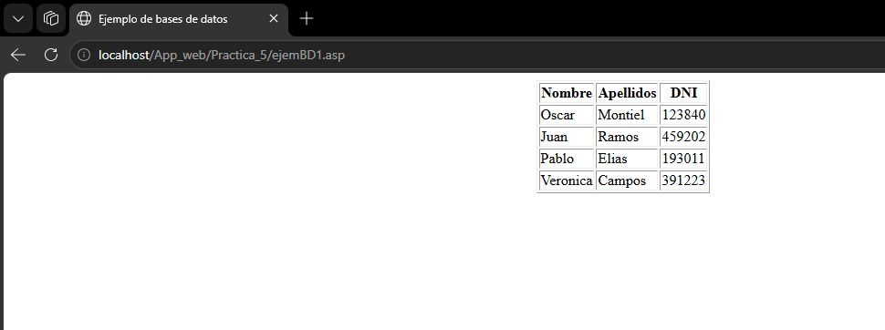

# Reporte - Práctica 5: ASP Clásico - Conexión a Bases de Datos con ADODB

---

**ASIGNATURA:**  
Desarrollo de Aplicaciones Web

**DOCENTE:**  
EUGENIA ERICA VERA CERVANTES

**ALUMNO:**  
MONTEALEGRE NAHUACATL OSVALDO 

**FECHA DE ENTREGA:**  
Jueves, 18 de junio de 2026

---


## Introducción

Se presenta un ejemplo de conexión desde ASP Clásico a una base de datos Microsoft Access (.accdb) utilizando el objeto `ADODB.Connection` y `ADODB.Recordset` a través de un DSN de sistema. El ejemplo lee los registros de la tabla `Datos_Alumnos` y los muestra en una tabla HTML.

El objetivo principal es comprender cómo ASP puede conectarse a una base de datos, ejecutar consultas y mostrar dinámicamente su contenido en una página web.

---

## Entorno y requisitos

Para visualizar y ejecutar correctamente los archivos de esta práctica se requiere lo siguiente:

- **Sistema operativo:** Windows 10/11 o Windows Server con IIS (Internet Information Services) instalado y habilitado.
- **IIS con ASP Clásico:** El rol de servidor web debe tener habilitado ASP (Active Server Pages) en las características de IIS.
- **Microsoft Access Database Engine:** Necesario para la conexión con archivos `.accdb`. Instalar el motor de base de datos de Access (Microsoft Access Database Engine 2016 Redistributable o similar).
- **DSN de Sistema "Alumnos":** Configurar un DSN de sistema ODBC que apunte al archivo `Base_Datos/Alumnos.accdb` utilizando el controlador "Microsoft Access Driver (*.mdb, *.accdb)".
- **Navegador web:** Cualquier navegador moderno (Chrome, Edge, Firefox) para solicitar la página ASP a través de HTTP.
- **Ubicación de los archivos:** Los archivos `.asp` y la carpeta `Base_Datos/` deben colocarse en el directorio del sitio web.
- **Permisos:** El directorio del sitio debe tener permisos de lectura para el usuario `IUSR` (IIS Anonymous User). La carpeta `Base_Datos/` requiere permisos de lectura y escritura si se realizarán operaciones de modificación.
- **Editor de código:** Recomendable usar un editor como VS Code, Notepad++ o Bloc de notas para revisar y modificar el código fuente.

---

## Configuración del DSN (ODBC)

Para que el ejemplo funcione correctamente, es necesario crear un DSN de sistema llamado "Alumnos" que apunte a la base de datos `Alumnos.accdb`. Siga estos pasos:

1. Abra **Herramientas administrativas de Windows** → **Orígenes de datos ODBC (64 bits)**.
2. Seleccione la pestaña **DSN de sistema** y haga clic en **Agregar**.
3. Elija el controlador **Microsoft Access Driver (*.mdb, *.accdb)** y haga clic en **Finalizar**.
4. En **Nombre de origen de datos**, escriba: `Alumnos`.
5. En **Base de datos**, haga clic en **Seleccionar** y busque el archivo `Base_Datos/Alumnos.accdb`.
6. Haga clic en **Aceptar** para guardar la configuración.

---

## Ejecución

Para ejecutar el ejemplo de esta práctica siga estos pasos:

1. Asegúrese de que IIS esté instalado y en ejecución en su equipo Windows.
2. Copie todos los archivos de la práctica al directorio del sitio web (`C:\inetpub\wwwroot\App_web\Practica_5\`).
3. Verifique que el DSN de sistema "Alumnos" esté configurado correctamente (ver sección anterior).
4. Abra un navegador web y acceda a la siguiente URL:
    - `http://localhost/App_web/Practica_5/ejemBD_1.asp`
5. Si la conexión es exitosa, se mostrará una tabla con los registros de la tabla `Datos_Alumnos`.

---

## Ejemplo: Conexión a base de datos Access desde ASP

**Archivo:** `ejemBD_1.asp`

Este ejemplo conecta a una base de datos Microsoft Access mediante ADODB, utilizando un DSN de sistema. Lee todos los registros de la tabla `Datos_Alumnos` y los despliega en una tabla HTML con los campos `Nombre`, `Apellidos` y `DNI`.

```asp
<%@ Language="VBScript" %>
<% Option Explicit %>
<!DOCTYPE html>
<html lang="en">
<head>
    <meta charset="UTF-8">
    <title>Ejemplo de bases de datos</title>
</head>
<body>
    <% 
    Dim Obj_Conn, Obj_RS
    ' Crear objetos
    Set Obj_Conn = Server.CreateObject("ADODB.Connection")
    Set Obj_RS = Server.CreateObject("ADODB.Recordset")
    
    ' Abrir conexion (DSN "Alumnos" debe estar configurado)
    Obj_Conn.Open "Alumnos"
    
    ' Abrir tabla
    Obj_RS.Open "Datos_Alumnos", Obj_Conn, 3, 3
    
    If Obj_RS.EOF Then
        Response.Write "<CENTER><H1>NO EXISTE REGISTRO</H1></CENTER>"
    Else
    %>
    <table border="1" align="center">
        <tr>
            <th>Nombre</th>
            <th>Apellidos</th>
            <th>DNI</th>
        </tr>
        <% Do While Not Obj_RS.EOF %>
        <tr>
            <td><%=Obj_RS("Nombre")%></td>
            <td><%=Obj_RS("Apellido")%></td>
            <td><%=Obj_RS("DNI")%></td>
        </tr>
        <% 
        Obj_RS.MoveNext 
        Loop 
        %>
    </table>
    <% 
    End If 
    
    ' Limpieza
    Obj_RS.Close
    Obj_Conn.Close
    Set Obj_RS = Nothing
    Set Obj_Conn = Nothing
    %>
</body>
</html>
```

**Explicación del código:**

| Elemento | Descripción |
|---|---|
| `<%@ Language="VBScript" %>` | Especifica que se usará VBScript como lenguaje de scripting. |
| `<% Option Explicit %>` | Obliga a declarar todas las variables antes de usarlas, evitando errores por nombres mal escritos. |
| `Server.CreateObject("ADODB.Connection")` | Crea una instancia del objeto `Connection` de ADODB para establecer la conexión con la base de datos. |
| `Server.CreateObject("ADODB.Recordset")` | Crea una instancia del objeto `Recordset` para almacenar y manipular los registros obtenidos de la consulta. |
| `Obj_Conn.Open "Alumnos"` | Abre la conexión utilizando el DSN de sistema llamado "Alumnos". |
| `Obj_RS.Open "Datos_Alumnos", Obj_Conn, 3, 3` | Abre la tabla `Datos_Alumnos` con cursores dinámicos (`adOpenDynamic = 3`) y bloqueo optimista (`adLockOptimistic = 3`). |
| `Obj_RS.EOF` | Propiedad que indica si se ha alcanzado el final del conjunto de registros. |
| `Do While Not Obj_RS.EOF ... Loop` | Bucle que recorre todos los registros de la tabla mientras haya datos. |
| `Obj_RS("Nombre")` | Obtiene el valor del campo `Nombre` del registro actual. |
| `Obj_RS.MoveNext` | Avanza al siguiente registro en el conjunto. |
| `Obj_RS.Close` / `Obj_Conn.Close` | Cierra el recordset y la conexión para liberar recursos. |
| `Set Obj_RS = Nothing` / `Set Obj_Conn = Nothing` | Libera los objetos de la memoria. |

El flujo del programa es el siguiente:

1. Se crean los objetos `Connection` y `Recordset`.
2. Se abre la conexión a la base de datos mediante el DSN "Alumnos".
3. Se abre la tabla `Datos_Alumnos`.
4. Si la tabla está vacía (`Obj_RS.EOF = True`), se muestra un mensaje indicando que no existen registros.
5. En caso contrario, se genera una tabla HTML y se itera sobre cada registro mostrando `Nombre`, `Apellido` y `DNI`.
6. Finalmente, se cierran y liberan los objetos para evitar fugas de memoria.

---

## Estructura de la base de datos

**Archivo:** `Base_Datos/Alumnos.accdb`

La base de datos es un archivo de Microsoft Access que contiene la tabla `Datos_Alumnos` con al menos los siguientes campos:

| Campo | Tipo de dato | Descripción |
|---|---|---|
| `Nombre` | Texto | Nombre del alumno |
| `Apellido` | Texto | Apellidos del alumno |
| `DNI` | Texto | Documento nacional de identidad |

---

## Pruebas de ejecución

A continuación se presentan las capturas de pantalla que muestran la ejecución del ejemplo en el navegador.

### Pantalla principal — Listado de alumnos


---

En esta práctica se ha demostrado cómo ASP Clásico puede conectarse a una base de datos Microsoft Access mediante ADODB y un DSN de sistema. Se utilizaron los objetos `Connection` y `Recordset` para abrir una conexión, recorrer los registros de la tabla `Datos_Alumnos` y mostrar su contenido en una tabla HTML. Este enfoque sienta las bases para el desarrollo de aplicaciones web dinámicas con acceso a bases de datos desde ASP.
