# Reporte - Práctica 6: ASP Clásico - Operaciones CRUD con Bases de Datos

---

**ASIGNATURA:**  
Desarrollo de Aplicaciones Web

**DOCENTE:**  
EUGENIA ERICA VERA CERVANTES

**ALUMNO:**  
MONTEALEGRE NAHUACATL OSVALDO 

**FECHA DE ENTREGA:**  
Sábado, 20 de junio de 2026

---

## Introducción

Se presentan 13 ejemplos de ASP Clásico que implementan las operaciones CRUD (Create, Read, Update, Delete) sobre una base de datos Microsoft Access (.accdb) utilizando los objetos `ADODB.Connection` y `ADODB.Recordset`. Los ejemplos abarcan desde la lectura básica de registros hasta la inserción, modificación y eliminación de datos, así como búsquedas con filtros y paginación de resultados, empleando tanto VBScript como JScript como lenguajes de scripting.

El objetivo principal es comprender cómo ASP puede realizar el manejo completo de datos en una base de datos a través de ADODB, implementando las cuatro operaciones fundamentales y utilizando diferentes técnicas como filtros, paginación y conexión directa OLEDB.

---

## Entorno y requisitos

Para visualizar y ejecutar correctamente los archivos de esta práctica se requiere lo siguiente:

- **Sistema operativo:** Windows 10/11 o Windows Server con IIS (Internet Information Services) instalado y habilitado.
- **IIS con ASP Clásico:** El rol de servidor web debe tener habilitado ASP (Active Server Pages) en las características de IIS.
- **Microsoft Access Database Engine:** Necesario para la conexión con archivos `.accdb`. Instalar el motor de base de datos de Access (Microsoft Access Database Engine 2016 Redistributable o similar).
- **DSN de Sistema "Alumnos":** Configurar un DSN de sistema ODBC que apunte al archivo `Base_Datos/Alumnos.accdb` utilizando el controlador "Microsoft Access Driver (*.mdb, *.accdb)".
- **Navegador web:** Cualquier navegador moderno (Chrome, Edge, Firefox) para solicitar las páginas ASP a través de HTTP.
- **Ubicación de los archivos:** Los archivos `.asp` y la carpeta `Base_Datos/` deben colocarse en el directorio del sitio web.
- **Permisos:** El directorio del sitio debe tener permisos de lectura para el usuario `IUSR` (IIS Anonymous User). La carpeta `Base_Datos/` requiere permisos de lectura y escritura para las operaciones de inserción, modificación y eliminación.
- **Editor de código:** Recomendable usar un editor como VS Code, Notepad++ o Bloc de notas para revisar y modificar el código fuente.

---

## Configuración del DSN (ODBC)

Para que los ejemplos 1 al 7 funcionen correctamente, es necesario crear un DSN de sistema llamado "Alumnos" que apunte a la base de datos `Alumnos.accdb`. Siga estos pasos:

1. Abra **Herramientas administrativas de Windows** → **Orígenes de datos ODBC (64 bits)**.
2. Seleccione la pestaña **DSN de sistema** y haga clic en **Agregar**.
3. Elija el controlador **Microsoft Access Driver (*.mdb, *.accdb)** y haga clic en **Finalizar**.
4. En **Nombre de origen de datos**, escriba: `Alumnos`.
5. En **Base de datos**, haga clic en **Seleccionar** y busque el archivo `Base_Datos/Alumnos.accdb`.
6. Haga clic en **Aceptar** para guardar la configuración.

Los ejemplos 8 al 13 utilizan conexión directa OLEDB (Provider=Microsoft.ACE.OLEDB.12.0) y no requieren DSN, pero sí necesitan el Microsoft Access Database Engine instalado.

---

## Archivos de la práctica

La práctica contiene los siguientes archivos:

| Archivo | Lenguaje | Descripción |
|---|---|---|
| `ejem_1.asp` | VBScript | Lectura básica de tabla con `Connection.Execute()` |
| `ejem_2.asp` | VBScript | Lectura dinámica usando la colección `Fields` |
| `ejem_3.asp` | JScript | Lectura equivalente a ejem_1 pero con JScript |
| `ejem_4.asp` | VBScript | Búsqueda por nombre con filtro (`Filter`) y formulario POST |
| `ejem_5.asp` | JScript | Búsqueda por nombre equivalente a ejem_4 con JScript |
| `ejem_6.asp` | VBScript | Paginación de resultados con QueryString (Anterior/Siguiente) |
| `ejem_7.asp` | VBScript | Paginación con variables de Session y botones de formulario |
| `ejem_8.asp` | VBScript | Insertar un nuevo registro con `AddNew` |
| `ejem_9.asp` | JScript | Insertar un nuevo registro equivalente a ejem_8 con JScript |
| `ejem_10.asp` | VBScript | Modificar datos de un alumno por DNI |
| `ejem_11.asp` | JScript | Modificar DNI de un alumno |
| `ejem_12.asp` | VBScript | Eliminar un alumno por DNI |
| `ejem_13.asp` | JScript | Eliminar un alumno por DNI |

---

## Ejecución

Para ejecutar los ejemplos de esta práctica siga estos pasos:

1. Asegúrese de que IIS esté instalado y en ejecución en su equipo Windows.
2. Copie todos los archivos de la práctica al directorio del sitio web (`C:\inetpub\wwwroot\App_web\Practica_6\`).
3. Verifique que el DSN de sistema "Alumnos" esté configurado correctamente (ver sección anterior).
4. Abra un navegador web y acceda a la siguiente URL para cada ejemplo:
    - `http://localhost/App_web/Practica_6/ejem_1.asp`
    - `http://localhost/App_web/Practica_6/ejem_2.asp`
    - ... hasta `ejem_13.asp`
5. Para los ejemplos 4 al 13, utilice los formularios incluidos en cada página para interactuar.

---

## Ejemplo 1: Lectura básica de tabla con `Connection.Execute()`

**Archivo:** `ejem_1.asp`

Este ejemplo conecta a la base de datos mediante el DSN "Alumnos" y ejecuta una consulta SQL directa con `Connection.Execute()`. Muestra los campos `DNI`, `Nombre`, `Apellidos`, `Direccion` y `Telefono` en una tabla HTML.

```asp
<%@ Language="VBScript" %>
<!DOCTYPE html>
<html lang="en">
<head>
    <meta charset="UTF-8">
    <title>Ejemplo Sencillo de BD</title>
</head>
<body>
    <h3> Tabla "Fichas" de la base de datos "Ejemplo_1" </h3>

    <% 
    ' 1. Definición de objetos
    Dim Ob_Conn, Ob_RS
    Set Ob_Conn = Server.CreateObject("ADODB.Connection")
    
    ' 2. Abrir conexión usando el DSN llamado "Alumnos"
    Ob_Conn.Open "DSN=Alumnos"
    
    ' 3. Ejecutar consulta
    Set Ob_RS = Ob_Conn.Execute("SELECT * FROM Datos_Alumnos")
    %>

    <CENTER>
        <TABLE BORDER="1">
            <TR>
                <TH> DNI </TH>
                <TH> NOMBRE </TH>
                <TH> APELLIDOS </TH>
                <TH> DIRECCION </TH>
                <TH> TELEFONO </TH>
            </TR>
            <% 
            ' 4. Bucle para recorrer la tabla
            Do While Not Ob_RS.EOF 
            %>
                <TR>
                    <TD><%=Ob_RS("DNI")%></TD>
                    <TD><%=Ob_RS("Nombre")%></TD>
                    <TD><%=Ob_RS("Apellidos")%></TD>
                    <TD><%=Ob_RS("Direccion")%></TD>
                    <TD><%=Ob_RS("Telefono")%></TD>
                </TR>
            <% 
                Ob_RS.MoveNext
            Loop 
            
            ' 5. Limpieza
            Ob_RS.Close
            Ob_Conn.Close
            Set Ob_RS = Nothing
            Set Ob_Conn = Nothing
            %>
        </TABLE>
    </CENTER>
</body>
</html>
```

**Explicación del código:**

| Elemento | Descripción |
|---|---|
| `Server.CreateObject("ADODB.Connection")` | Crea el objeto de conexión ADODB. |
| `Ob_Conn.Open "DSN=Alumnos"` | Abre la conexión utilizando el DSN de sistema "Alumnos". |
| `Ob_Conn.Execute("SELECT * FROM Datos_Alumnos")` | Ejecuta la consulta SQL directamente y devuelve un Recordset. |
| `Do While Not Ob_RS.EOF ... Loop` | Itera sobre todos los registros devueltos. |
| `Ob_RS("Nombre")` | Obtiene el valor del campo especificado del registro actual. |
| `Ob_RS.Close` / `Ob_Conn.Close` | Libera los recursos cerrando recordset y conexión. |

---

## Ejemplo 2: Lectura dinámica con colección Fields

**Archivo:** `ejem_2.asp`

Este ejemplo utiliza `Obj_RS.Fields` para recorrer dinámicamente todas las columnas de la tabla, mostrando los nombres de los campos en los encabezados y sus valores en las filas, independientemente de la estructura de la tabla.

```asp
<%@ Language="VBScript" %>
<% Option Explicit %>
<!DOCTYPE html>
<html lang="en">
<head>
    <meta charset="UTF-8">
    <title>Ejemplo de bases de datos</title>
</head>
<body>
    <% 
    Dim Obj_Conn, Obj_RS, I
    Set Obj_Conn = Server.CreateObject("ADODB.Connection")
    Set Obj_RS = Server.CreateObject("ADODB.Recordset")
    
    Obj_Conn.Open "Alumnos"
    Obj_RS.Open "Datos_Alumnos", Obj_Conn, 3, 3
    
    If Obj_RS.EOF Then
        Response.Write "<CENTER><H1>NO EXISTEN REGISTROS</H1></CENTER>"
    Else
    %>
    <table border="1" align="center">
        <tr>
            <% For I = 0 To Obj_RS.Fields.Count - 1 %>
                <th><%= Obj_RS.Fields(I).Name %></th>
            <% Next %>
        </tr>
        
        <% Do While Not Obj_RS.EOF %>
        <tr>
            <% For I = 0 To Obj_RS.Fields.Count - 1 %>
                <td><%= Obj_RS.Fields(I).Value %></td>
            <% Next %>
        </tr>
        <% 
            Obj_RS.MoveNext
        Loop 
        %>
    </table>
    <% 
    End If 
    
    Obj_RS.Close
    Obj_Conn.Close
    Set Obj_RS = Nothing
    Set Obj_Conn = Nothing
    %>
</body>
</html>
```

**Explicación del código:**

| Elemento | Descripción |
|---|---|
| `Obj_RS.Fields.Count` | Número total de campos (columnas) en el recordset. |
| `Obj_RS.Fields(I).Name` | Nombre del campo en la posición `I`. |
| `Obj_RS.Fields(I).Value` | Valor del campo en la posición `I` para el registro actual. |
| `For I = 0 To Obj_RS.Fields.Count - 1` | Bucle que itera por todas las columnas dinámicamente. |

Este enfoque tiene la ventaja de que el código funciona sin modificaciones aunque la estructura de la tabla cambie (se agreguen o quiten columnas).

---

## Ejemplo 3: Lectura con JScript

**Archivo:** `ejem_3.asp`

Este ejemplo es funcionalmente equivalente a los anteriores, pero utiliza **JScript** como lenguaje de scripting en lugar de VBScript. Se declara con `<%@ LANGUAGE="JScript" %>`.

```asp
<%@ LANGUAGE="JScript" %>
<!DOCTYPE html>
<html lang="en">
<head>
    <meta charset="UTF-8">
    <title>Ejemplo Sencillo de BD</title>
</head>
<body>
    <h3>Tabla "Fichas" de la base de datos "EjemploBD"</h3>
    
    <%
    var Ob_Conn = Server.CreateObject("ADODB.Connection");
    Ob_Conn.Open("Alumnos");
    var Ob_RS = Ob_Conn.Execute("SELECT * FROM Datos_Alumnos");
    var Num_Campos = Ob_RS.Fields.Count;
    %>

    <% if (!Ob_RS.EOF) { %>
        <CENTER>
            <TABLE BORDER="1">
                <TR>
                <% for (var Campo = 0; Campo < Num_Campos; Campo++) { %>
                    <TH><%= Ob_RS(Campo).Name %></TH>
                <% } %>
                </TR>

                <% while (!Ob_RS.EOF) { %>
                    <TR>
                    <% for (var Campo = 0; Campo < Num_Campos; Campo++) { %>
                        <TD><%= Ob_RS(Campo).Value %></TD>
                    <% } %>
                    </TR>
                <% 
                    Ob_RS.MoveNext();
                } 
                %>
            </TABLE>
        </CENTER>
    <% } %>
</body>
</html>
```

**Particularidades de JScript en ASP:**

| Elemento | Descripción |
|---|---|
| `<%@ LANGUAGE="JScript" %>` | Cambia el lenguaje de scripting por defecto a JScript. |
| `var` | Declaración de variables al estilo JavaScript. |
| `Ob_RS(Campo).Name` / `Ob_RS(Campo).Value` | Acceso a campos usando paréntesis e índice/posición. |
| `Movimiento en mayúsculas` | `!Ob_RS.EOF`, `Ob_RS.MoveNext()` con paréntesis. |

---

## Ejemplo 4: Búsqueda por nombre con filtro (Filter)

**Archivo:** `ejem_4.asp`

Este ejemplo presenta un formulario donde el usuario ingresa un nombre y, al enviarlo, se filtran los registros de la tabla usando la propiedad `Filter` del Recordset.

```asp
<%@ Language="VBScript" %>
<% Option Explicit %>
<!DOCTYPE html>
<html lang="en">
<head>
    <meta charset="UTF-8">
    <title>Buscador de Alumnos</title>
</head>
<body>
    <%
    ' Si el formulario no ha sido enviado, mostramos el buscador
    If Request.Form("Nombre") = "" Then
    %>
        <FORM METHOD="Post" ACTION="ejem_4.asp">
            Nombre del alumno: <INPUT NAME="Nombre"> 
            <INPUT TYPE="Submit" VALUE="Enviar">
        </FORM> 
    <%
    Else
        Dim Obj_Conn, Obj_RS, Nombre
        Nombre = Request.Form("Nombre")

        Set Obj_Conn = Server.CreateObject("ADODB.Connection")
        Set Obj_RS = Server.CreateObject("ADODB.Recordset")

        Obj_Conn.Open "Alumnos"
        Obj_RS.Open "Datos_Alumnos", Obj_Conn, 3, 3
        
        ' Aplicamos el filtro
        Obj_RS.Filter = "Nombre='" & Nombre & "'"

        If Obj_RS.EOF Then
            Response.Write "<CENTER><H1>NO EXISTEN REGISTROS PARA: " & Nombre & "</H1></CENTER>"
        Else
    %>
            <TABLE BORDER="1" ALIGN="CENTER">
                <TR>
                    <TH>Nombre</TH>
                    <TH>Apellidos</TH>
                    <TH>D.N.I</TH>
                </TR> 
                <% Do While Not Obj_RS.EOF %>
                <TR>
                    <TD><%= Obj_RS("Nombre") %></TD>
                    <TD><%= Obj_RS("Apellidos") %></TD>
                    <TD><%= Obj_RS("DNI") %></TD>
                </TR> 
                <% Obj_RS.MoveNext : Loop %>
            </TABLE>
    <%
        End If
        Obj_RS.Close : Obj_Conn.Close
        Set Obj_RS = Nothing : Set Obj_Conn = Nothing
    End If
    %>
</body>
</html>
```

**Explicación del código:**

| Elemento | Descripción |
|---|---|
| `Request.Form("Nombre")` | Recupera el valor enviado desde el formulario HTML. |
| `Obj_RS.Filter = "Nombre='...'"` | Filtra los registros del Recordset sin volver a consultar la BD. |
| `If Request.Form("Nombre") = ""` | Verifica si el formulario ha sido enviado (POST). |
| `Else ... End If` | Estructura que separa la vista del formulario del procesamiento. |

---

## Ejemplo 5: Búsqueda con Filter en JScript

**Archivo:** `ejem_5.asp`

Equivalente al ejemplo 4 pero implementado en JScript. También utiliza la propiedad `Filter` del Recordset.

```asp
<%@ LANGUAGE="JScript" %>
<!DOCTYPE html>
<html lang="en">
<head>
    <meta charset="UTF-8">
    <title>Filtrar un registro</title>
</head>
<body>
    <%
    // Verificamos si se ha enviado el formulario
    if (Request.Form("Nombre").Count > 0) {
        var Ob_Conn = Server.CreateObject("ADODB.Connection");
        var Ob_RS = Server.CreateObject("ADODB.Recordset");

        // Abrimos la conexión y el recordset
        Ob_Conn.Open("DSN=Alumnos");
        // Nota: adOpenStatic=3, adCmdTable=2
        Ob_RS.Open("Datos_Alumnos", Ob_Conn, 3, 1, 2);

        // Aplicamos el filtro
        var nombreBusqueda = Request.Form("Nombre");
        Ob_RS.Filter = "Nombre = '" + nombreBusqueda + "'";
    %>
        <h3>Estos son las personas encontradas</h3>
        <table border="1">
            <tr>
                <th>DNI</th>
                <th>NOMBRE</th>
                <th>APELLIDOS</th>
                <th>DIRECCION</th>
                <th>TELEFONO</th>
            </tr>
            <% while (!Ob_RS.EOF) { %>
                <tr>
                    <td><%= Ob_RS("DNI").Value %></td>
                    <td><%= Ob_RS("Nombre").Value %></td>
                    <td><%= Ob_RS("Apellidos").Value %></td>
                    <td><%= Ob_RS("Direccion").Value %></td>
                    <td><%= Ob_RS("Telefono").Value %></td>
                </tr>
            <% 
                Ob_RS.MoveNext();
            } 
            %>
        </table>
    <%
        Ob_RS.Close();
        Ob_Conn.Close();
    } else { 
    %>
        <h3>ESCRIBA EL NOMBRE A BUSCAR</h3>
        <br>
        <form method="Post" action="ejem_5.asp">
            NOMBRE: <input name="Nombre" size="10">
            <br><br>
            <input type="Submit" value="Enviar datos">
            <input type="Reset" value="Borrar">
        </form>
    <% } %>
</body>
</html>
```

**Explicación del código:**

| Elemento | Descripción |
|---|---|
| `Request.Form("Nombre").Count > 0` | En JScript se verifica si el formulario fue enviado mediante la propiedad `Count`. |
| `Ob_RS.Open("Datos_Alumnos", Ob_Conn, 3, 1, 2)` | El quinto parámetro `2` indica `adCmdTable` para abrir directamente una tabla. |
| `Ob_RS.Filter = "Nombre = '" + nombre + "'"` | Aplica el filtro con sintaxis de JScript (concatenación con `+`). |

---

## Ejemplo 6: Paginación con QueryString

**Archivo:** `ejem_6.asp`

Este ejemplo implementa paginación de resultados utilizando `PageSize` y `AbsolutePage`. La navegación entre páginas se realiza mediante enlaces HTML con parámetros en la URL (QueryString).

```asp
<%@ Language="VBScript" %>
<% Option Explicit %>
<!DOCTYPE html>
<html lang="en">
<head>
    <meta charset="UTF-8">
    <title>Ejemplo de Paginación</title>
</head>
<body>
    <%
    Dim Obj_Conn, Obj_RS, Pagina, Cont
    
    Set Obj_Conn = Server.CreateObject("ADODB.Connection")
    Set Obj_RS = Server.CreateObject("ADODB.RecordSet")

    Obj_Conn.Open "DSN=Alumnos"
    ' CursorLocation 3 permite paginación (adUseClient)
    Obj_RS.CursorLocation = 3 
    Obj_RS.Open "Datos_Alumnos", Obj_Conn, 3, 3

    If Obj_RS.EOF Then
        Response.Write "<CENTER><H1>NO EXISTEN REGISTROS</H1></CENTER>"
    Else
        Obj_RS.PageSize = 5
        Pagina = Request.QueryString("Pagina")
        If Pagina = "" Then Pagina = 1 Else Pagina = CInt(Pagina)
    %>

    <TABLE BORDER="1" ALIGN="CENTER">
        <TR>
            <TD ALIGN="CENTER">
                <% If Pagina > 1 Then %>
                    <A HREF="ejem_6.asp?Pagina=<%=Pagina - 1%>">&lt;&lt; Anterior</A>
                <% End If %>
            </TD>
            <TD ALIGN="CENTER">Página <%=Pagina%> de <%=Obj_RS.PageCount%></TD>
            <TD ALIGN="CENTER">
                <% If Pagina < Obj_RS.PageCount Then %>
                    <A HREF="ejem_6.asp?Pagina=<%=Pagina + 1%>">Siguiente &gt;&gt;</A>
                <% End If %>
            </TD>
        </TR>
    </TABLE>

    <TABLE BORDER="1" ALIGN="CENTER">
        <TR>
            <TH>Nombre</TH>
            <TH>Apellidos</TH>
            <TH>D.N.I</TH>
        </TR>
        <%
        Obj_RS.AbsolutePage = Pagina
        Cont = 0
        Do While Not Obj_RS.EOF And Cont < Obj_RS.PageSize
        %>
        <TR>
            <TD><%=Obj_RS("Nombre")%></TD>
            <TD><%=Obj_RS("Apellidos")%></TD>
            <TD><%=Obj_RS("DNI")%></TD>
        </TR>
        <%
            Cont = Cont + 1
            Obj_RS.MoveNext
        Loop
        %>
    </TABLE>
    <%
    End If
    Obj_RS.Close : Obj_Conn.Close
    Set Obj_RS = Nothing : Set Obj_Conn = Nothing
    %>
</body>
</html>
```

**Explicación del código:**

| Elemento | Descripción |
|---|---|
| `Obj_RS.CursorLocation = 3` | Establece `adUseClient` (cursor del lado cliente), necesario para paginación. |
| `Obj_RS.PageSize = 5` | Define 5 registros por página. |
| `Obj_RS.AbsolutePage = Pagina` | Posiciona el Recordset en la página indicada. |
| `Request.QueryString("Pagina")` | Lee el número de página desde la URL. |
| `Obj_RS.PageCount` | Número total de páginas disponibles. |
| `Cont < Obj_RS.PageSize` | Limita la iteración al tamaño de página definido. |

---

## Ejemplo 7: Paginación con Session

**Archivo:** `ejem_7.asp`

Similar al ejemplo 6 pero utiliza variables de **Session** para mantener el número de página actual y botones de formulario en lugar de enlaces con QueryString.

```asp
<%@ Language="VBScript" %>
<% Option Explicit %>

<%
Dim Obj_Conn, Obj_RS, Registro

Set Obj_Conn = Server.CreateObject("ADODB.Connection")
Set Obj_RS = Server.CreateObject("ADODB.Recordset")

Obj_Conn.Open "DSN=Alumnos"

Obj_RS.CursorLocation = 3
Obj_RS.Open "Datos_Alumnos", Obj_Conn, 3, 3

If Obj_RS.EOF Then
    Response.Write "<H2>No existen registros</H2>"
Else

    Obj_RS.PageSize = 9

    If IsEmpty(Session("Pagina")) Then
        Session("Pagina") = 1
    End If

    If Request("Pagina") = "Pagina Siguiente" Then
        Session("Pagina") = Session("Pagina") + 1
    End If

    If Request("Pagina") = "Pagina Anterior" Then
        Session("Pagina") = Session("Pagina") - 1
    End If

    If Session("Pagina") < 1 Then
        Session("Pagina") = 1
    End If

    If Session("Pagina") > Obj_RS.PageCount Then
        Session("Pagina") = Obj_RS.PageCount
    End If

    Obj_RS.AbsolutePage = Session("Pagina")
%>

<TABLE BORDER="1" ALIGN="CENTER">
    <TR>
        <TH>DNI</TH>
        <TH>NOMBRE</TH>
        <TH>APELLIDOS</TH>
        <TH>DIRECCION</TH>
        <TH>TELEFONO</TH>
    </TR>

<%
    Registro = 0

    While Registro < Obj_RS.PageSize And Not Obj_RS.EOF
%>

    <TR>
        <TD><%=Obj_RS("DNI")%></TD>
        <TD><%=Obj_RS("Nombre")%></TD>
        <TD><%=Obj_RS("Apellidos")%></TD>
        <TD><%=Obj_RS("Direccion")%></TD>
        <TD><%=Obj_RS("Telefono")%></TD>
    </TR>

<%
        Registro = Registro + 1
        Obj_RS.MoveNext
    Wend
%>

</TABLE>

<BR>

<FORM METHOD="POST" ACTION="ejem_6.asp">

<% If Session("Pagina") > 1 Then %>
    <INPUT TYPE="SUBMIT"
           NAME="Pagina"
           VALUE="Pagina Anterior">
<% End If %>

<% If Session("Pagina") < Obj_RS.PageCount Then %>
    <INPUT TYPE="SUBMIT"
           NAME="Pagina"
           VALUE="Pagina Siguiente">
<% End If %>

</FORM>

<CENTER>
Página <%=Session("Pagina")%> de <%=Obj_RS.PageCount%>
</CENTER>

<%
End If

Obj_RS.Close
Obj_Conn.Close

Set Obj_RS = Nothing
Set Obj_Conn = Nothing
%>
```

**Explicación del código:**

| Elemento | Descripción |
|---|---|
| `Session("Pagina")` | Almacena el número de página actual en la sesión del usuario. |
| `IsEmpty(Session("Pagina"))` | Verifica si la variable de sesión existe (primera visita). |
| `Request("Pagina")` | Lee el valor del botón presionado ("Pagina Siguiente" / "Pagina Anterior"). |
| `Wend` | Palabra clave para cerrar un bloque `While` en VBScript. |

---

## Ejemplo 8: Insertar un registro (VBScript)

**Archivo:** `ejem_8.asp`

Este ejemplo presenta un formulario para ingresar los datos de un alumno y, al enviarlo, inserta un nuevo registro en la tabla `Datos_Alumnos` utilizando `AddNew`. Utiliza conexión directa OLEDB en lugar de DSN.

```asp
<%@ Language="VBScript" %>
<% Option Explicit %>
<!DOCTYPE html>
<html lang="es">
<head>
    <meta charset="UTF-8">
    <title>Insertar Alumno</title>
</head>
<body>

<%
If Request.Form("Nombre") = "" Then
%>

    <FORM METHOD="POST" ACTION="ejem_8.asp">
        <H2>Inserte sus datos</H2>
        Nombre: <INPUT TYPE="TEXT" NAME="Nombre"><BR><BR>
        Apellidos: <INPUT TYPE="TEXT" NAME="Apellidos"><BR><BR>
        DNI: <INPUT TYPE="TEXT" NAME="DNI"><BR><BR>
        Dirección: <INPUT TYPE="TEXT" NAME="Direccion"><BR><BR>
        Teléfono: <INPUT TYPE="TEXT" NAME="Telefono"><BR><BR>
        <INPUT TYPE="SUBMIT" VALUE="Enviar">
    </FORM>

<%
Else
    Dim Obj_Conn, Obj_RS
    Dim Nombre, Apellidos, DNI, Direccion, Telefono

    Nombre = Request.Form("Nombre")
    Apellidos = Request.Form("Apellidos")
    DNI = Request.Form("DNI")
    Direccion = Request.Form("Direccion")
    Telefono = Request.Form("Telefono")

    Set Obj_Conn = Server.CreateObject("ADODB.Connection")
    Set Obj_RS = Server.CreateObject("ADODB.Recordset")

    ' Conexión directa OLEDB (sin DSN)
    Obj_Conn.Open "Provider=Microsoft.ACE.OLEDB.12.0;Data Source=C:\inetpub\wwwroot\App_web\Practica_6\Base_Datos\Alumnos.accdb;Persist Security Info=False;"

    Obj_RS.Open "SELECT * FROM Datos_Alumnos", Obj_Conn, 2, 3

    Obj_RS.AddNew
    Obj_RS("Nombre") = Nombre
    Obj_RS("Apellidos") = Apellidos
    Obj_RS("DNI") = DNI
    Obj_RS("Direccion") = Direccion
    Obj_RS("Telefono") = Telefono
    Obj_RS.Update

    Obj_RS.Close : Obj_Conn.Close
    Set Obj_RS = Nothing : Set Obj_Conn = Nothing
%>

    <CENTER>
        <H1>DATOS INSERTADOS CORRECTAMENTE</H1>
        <P><B>Nombre:</B> <%=Nombre%></P>
        <P><B>Apellidos:</B> <%=Apellidos%></P>
        <P><B>DNI:</B> <%=DNI%></P>
        <P><B>Direccion:</B> <%=Direccion%></P>
        <P><B>Telefono:</B> <%=Telefono%></P>
    </CENTER>

<%
End If
%>

</body>
</html>
```

**Explicación del código:**

| Elemento | Descripción |
|---|---|
| `Provider=Microsoft.ACE.OLEDB.12.0` | Proveedor OLEDB para bases de datos Access 2007+ (.accdb). |
| `Data Source=...` | Ruta física al archivo de base de datos. |
| `Obj_RS.AddNew` | Prepara el Recordset para agregar un nuevo registro. |
| `Obj_RS("Campo") = valor` | Asigna valores a los campos del nuevo registro. |
| `Obj_RS.Update` | Guarda los cambios en la base de datos. |
| `adOpenKeyset = 2` | Tipo de cursor que permite ver cambios de otros usuarios. |
| `adLockOptimistic = 3` | Bloqueo optimista, bloquea solo durante `Update`. |

---

## Ejemplo 9: Insertar un registro (JScript)

**Archivo:** `ejem_9.asp`

Equivalente al ejemplo 8 pero implementado en JScript. Utiliza `Ob_RS.AddNew()` con paréntesis y asigna valores mediante `Ob_RS("Campo").Value = ...`.

```asp
<%@ LANGUAGE="JScript" %>
<!DOCTYPE html>
<html lang="en">
<head>
    <meta charset="UTF-8">
    <title>Insertar un registro</title>
</head>
<body>
<%
if (Request.Form("DNI").Count > 0) {
    var Ob_Conn = Server.CreateObject("ADODB.Connection");
    var Ob_RS = Server.CreateObject("ADODB.Recordset");

    Ob_Conn.Open("Provider=Microsoft.ACE.OLEDB.12.0;Data Source=C:\\inetpub\\wwwroot\\App_web\\Practica_6\\Base_Datos\\Alumnos.accdb;Persist Security Info=False;");

    Ob_RS.Open("SELECT * FROM Datos_Alumnos", Ob_Conn, 1, 3);

    Ob_RS.AddNew();
    Ob_RS("DNI").Value = Request.Form("DNI");
    Ob_RS("Nombre").Value = Request.Form("Nombre");
    Ob_RS("Apellidos").Value = Request.Form("Apellidos");
    Ob_RS("Direccion").Value = Request.Form("Direccion");
    Ob_RS("Telefono").Value = Request.Form("Telefono");
    Ob_RS.Update();

    Ob_RS.Close();
    Ob_Conn.Close();
    
    Response.Write("<h3>Datos insertados correctamente</h3>");
    Response.Write("<a href=ejem_9.asp>Volver</a>");
} else {
%>
    <h3>ESCRIBA SUS DATOS PERSONALES</h3>
    <br>
    <form method="Post" action="ejem_9.asp">
        DNI: <input name="DNI" size="10"><br>
        NOMBRE: <input name="Nombre" size="15"><br>
        APELLIDOS: <input name="Apellidos" size="30"><br>
        DIRECCION: <input name="Direccion" size="30"><br>
        TELEFONO: <input name="Telefono" size="15"><br>
        <input type="Submit" value="Enviar datos">
        <input type="Reset" value="Borrar">
    </form>
<% 
} 
%>
</body>
</html>
```

---

## Ejemplo 10: Modificar un registro (VBScript)

**Archivo:** `ejem_10.asp`

Este ejemplo permite modificar los datos de un alumno existente. El usuario ingresa el DNI del alumno y los nuevos valores, y el sistema actualiza el registro correspondiente.

```asp
<%@ Language="VBScript" %>
<% Option Explicit %>
<!DOCTYPE html>
<html lang="es">
<head>
    <meta charset="UTF-8">
    <title>Modificar los datos de un alumno</title>
</head>
<body>
<%
If Request.Form("DNI") = "" Then
%>
    <form method="Post" action="ejem_10.asp">
        <h2>Inserte el DNI del alumno que desee actualizar y los nuevos datos</h2>
        DNI: <input name="DNI"><br>
        Nombre: <input name="Nombre"><br>
        Apellidos: <input name="Apellidos"><br>
        Dirección: <input name="Direccion"><br>
        Teléfono: <input name="Telefono"><br>
        <input type="Submit" value="Enviar">
    </form>
<%
Else
    Dim Obj_Conn, Obj_RS
    Dim Nombre, Apellidos, DNI, Direccion, Telefono

    Nombre    = Request.Form("Nombre")
    Apellidos = Request.Form("Apellidos")
    DNI       = Request.Form("DNI")
    Direccion = Request.Form("Direccion")
    Telefono  = Request.Form("Telefono")

    Set Obj_Conn = Server.CreateObject("ADODB.Connection")
    Set Obj_RS   = Server.CreateObject("ADODB.Recordset")

    Obj_Conn.Open "Provider=Microsoft.ACE.OLEDB.12.0;Data Source=C:\inetpub\wwwroot\App_web\Practica_6\Base_Datos\Alumnos.accdb;Persist Security Info=False;"

    Obj_RS.Open "SELECT * FROM Datos_Alumnos WHERE DNI=" & DNI, Obj_Conn, 1, 3

    If Not Obj_RS.EOF Then
        Obj_RS("Nombre")    = Nombre
        Obj_RS("Apellidos") = Apellidos
        Obj_RS("Direccion") = Direccion
        Obj_RS("Telefono")  = Telefono
        Obj_RS.Update
    End If

    Obj_RS.Close
    Obj_Conn.Close

    Set Obj_RS = Nothing
    Set Obj_Conn = Nothing
%>
    <center><h1>DATOS ACTUALIZADOS</h1></center>
<%
End If
%>
</body>
</html>
```

**Explicación del código:**

| Elemento | Descripción |
|---|---|
| `WHERE DNI=` & DNI | Filtra la consulta SQL para obtener solo el registro con ese DNI. |
| `Obj_RS("Campo") = valor` | Modifica los valores del registro actual. |
| `Obj_RS.Update` | Confirma los cambios en la base de datos. |

---

## Ejemplo 11: Modificar un registro (JScript)

**Archivo:** `ejem_11.asp`

Equivalente al ejemplo 10 pero en JScript. Modifica específicamente el campo DNI de un alumno, utilizando `parseInt()` para la conversión del valor numérico.

```asp
<%@ LANGUAGE="JScript" %>
<!DOCTYPE html>
<html lang="es">
<head>
    <meta charset="UTF-8">
    <title>Modificar un registro</title>
</head>
<body>
<%
if (Request.Form("DNI").Count > 0) {
    var Ob_Conn = Server.CreateObject("ADODB.Connection");
    var Ob_RS   = Server.CreateObject("ADODB.Recordset");

    Ob_Conn.Open("Provider=Microsoft.ACE.OLEDB.12.0;Data Source=C:\\inetpub\\wwwroot\\App_web\\Practica_6\\Base_Datos\\Alumnos.accdb;Persist Security Info=False;");

    var sql = "SELECT * FROM Datos_Alumnos WHERE DNI=" + Request.Form("DNI");

    Ob_RS.Open(sql, Ob_Conn, 1, 3);

    if (!Ob_RS.EOF) {
        Ob_RS("DNI").Value = parseInt(Request.Form("Nuevo_DNI"));
        Ob_RS.Update();
        Response.Write("<h3>Dato modificado</h3>");
    } else {
        Response.Write("<h3>No se encontró el alumno con ese DNI</h3>");
    }

    Ob_RS.Close();
    Ob_Conn.Close();
} else {
%>
    <h3>ESCRIBA EL D.N.I. A MODIFICAR</h3><br>
    <form method="Post" action="ejem_11.asp">
        ANTIGUO DNI: <input name="DNI" size="10"><br><br>
        NUEVO DNI: <input name="Nuevo_DNI" size="10"><br><br>
        <input type="Submit" value="Enviar datos">
        <input type="Reset" value="Borrar">
    </form>
<% } %>
</body>
</html>
```

---

## Ejemplo 12: Eliminar un registro (VBScript)

**Archivo:** `ejem_12.asp`

Este ejemplo permite eliminar un alumno de la base de datos ingresando su DNI. Utiliza el método `Delete` del Recordset.

```asp
<%@ Language="VBScript" %>
<% Option Explicit %>
<!DOCTYPE html>
<html lang="es">
<head>
    <meta charset="UTF-8">
    <title>Borrar un alumno de la base de datos</title>
</head>
<body>
<%
If Request.Form("DNI") = "" Then
%>
    <form method="Post" action="ejem_12.asp">
        <h2>Inserte el DNI del alumno que desee borrar</h2>
        DNI: <input name="DNI"><br><br>
        <input type="Submit" value="Enviar">
    </form>
<%
Else
    Dim Obj_Conn, Obj_RS, DNI
    DNI = Request.Form("DNI")

    Set Obj_Conn = Server.CreateObject("ADODB.Connection")
    Set Obj_RS   = Server.CreateObject("ADODB.Recordset")

    Obj_Conn.Open "Provider=Microsoft.ACE.OLEDB.12.0;Data Source=C:\inetpub\wwwroot\App_web\Practica_6\Base_Datos\Alumnos.accdb;Persist Security Info=False;"

    Obj_RS.Open "SELECT * FROM Datos_Alumnos WHERE DNI=" & DNI, Obj_Conn, 1, 3

    If Not Obj_RS.EOF Then
        Obj_RS.Delete
        Response.Write("<center><h1>DATOS ELIMINADOS</h1></center>")
    Else
        Response.Write("<center><h1>No se encontró el alumno con ese DNI</h1></center>")
    End If

    Obj_RS.Close
    Obj_Conn.Close
    Set Obj_RS = Nothing
    Set Obj_Conn = Nothing
End If
%>
</body>
</html>
```

**Explicación del código:**

| Elemento | Descripción |
|---|---|
| `Obj_RS.Delete` | Elimina el registro actual del Recordset y de la base de datos. |
| `WHERE DNI=` & DNI | Localiza el registro específico a eliminar. |
| Validación `If Not Obj_RS.EOF` | Verifica que el registro exista antes de eliminarlo. |

---

## Ejemplo 13: Eliminar un registro (JScript)

**Archivo:** `ejem_13.asp`

Equivalente al ejemplo 12 pero implementado en JScript. Utiliza `Ob_RS.Delete()` con paréntesis.

```asp
<%@ LANGUAGE="JScript" %>
<!DOCTYPE html>
<html lang="es">
<head>
    <meta charset="UTF-8">
    <title>Borrar un registro</title>
</head>
<body>
<%
if (Request.Form("DNI").Count > 0) {
    var Ob_Conn = Server.CreateObject("ADODB.Connection");
    var Ob_RS   = Server.CreateObject("ADODB.Recordset");

    Ob_Conn.Open("Provider=Microsoft.ACE.OLEDB.12.0;Data Source=C:\\inetpub\\wwwroot\\App_web\\Practica_6\\Base_Datos\\Alumnos.accdb;Persist Security Info=False;");

    var sql = "SELECT * FROM Datos_Alumnos WHERE DNI=" + Request.Form("DNI");

    Ob_RS.Open(sql, Ob_Conn, 1, 3);

    if (!Ob_RS.EOF) {
        Ob_RS.Delete();
        Response.Write("<h3>Dato borrado</h3>");
    } else {
        Response.Write("<h3>No se encontró el usuario con ese DNI</h3>");
    }

    Ob_RS.Close();
    Ob_Conn.Close();
} else {
%>
    <h3>ESCRIBA EL D.N.I. DEL USUARIO A BORRAR</h3><br>
    <form method="Post" action="ejem_13.asp">
        DNI: <input name="DNI" size="10"><br><br>
        <input type="Submit" value="Enviar datos">
        <input type="Reset" value="Borrar">
    </form>
<% } %>
</body>
</html>
```

---

## Estructura de la base de datos

**Archivo:** `Base_Datos/Alumnos.accdb`

La base de datos es un archivo de Microsoft Access que contiene la tabla `Datos_Alumnos` con los siguientes campos:

| Campo | Tipo de dato | Descripción |
|---|---|---|
| `DNI` | Texto (o Numérico) | Documento nacional de identidad (clave del registro) |
| `Nombre` | Texto | Nombre del alumno |
| `Apellidos` | Texto | Apellidos del alumno |
| `Direccion` | Texto | Dirección del alumno |
| `Telefono` | Texto | Teléfono del alumno |

A diferencia de la práctica anterior, esta tabla incluye dos campos adicionales: `Direccion` y `Telefono`.

---

## Resumen de operaciones CRUD implementadas

| Operación | VBScript | JScript | Método ADODB |
|---|---|---|---|
| **Create** (Insertar) | `ejem_8.asp` | `ejem_9.asp` | `AddNew` + `Update` |
| **Read** (Leer) | `ejem_1.asp`, `ejem_2.asp` | `ejem_3.asp` | `Execute` / `Open` |
| **Read** (Buscar) | `ejem_4.asp` | `ejem_5.asp` | `Filter` |
| **Read** (Paginación) | `ejem_6.asp`, `ejem_7.asp` | — | `PageSize` + `AbsolutePage` |
| **Update** (Modificar) | `ejem_10.asp` | `ejem_11.asp` | `Update` |
| **Delete** (Eliminar) | `ejem_12.asp` | `ejem_13.asp` | `Delete` |

---

## Conexiones utilizadas

| Tipo | Cadena de conexión | Ejemplos |
|---|---|---|
| **DSN de sistema** | `"Alumnos"` o `"DSN=Alumnos"` | ejem_1 al ejem_7 |
| **OLEDB directa** | `"Provider=Microsoft.ACE.OLEDB.12.0;Data Source=...\Alumnos.accdb;Persist Security Info=False;"` | ejem_8 al ejem_13 |

La conexión OLEDB directa no requiere DSN, pero necesita que el Microsoft Access Database Engine esté instalado en el servidor.

---

## Pruebas de ejecución

A continuación se presentan las capturas de pantalla que muestran la ejecución de los ejemplos en el navegador.

### Pantalla — Ejemplo 1: Lectura básica
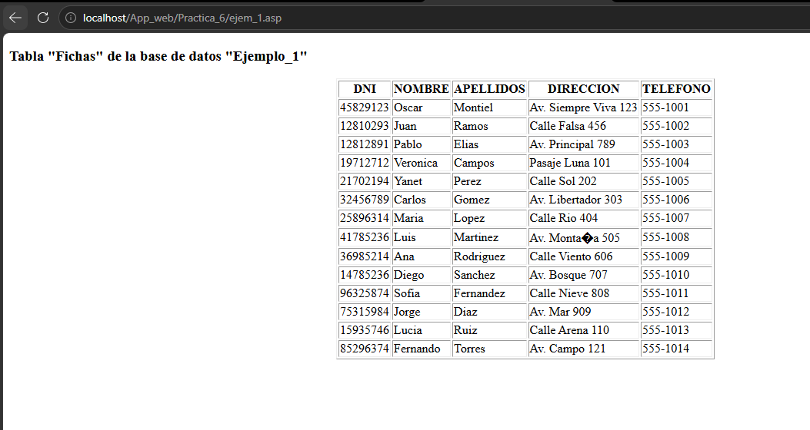

### Pantalla — Ejemplo 2: Lectura dinámica
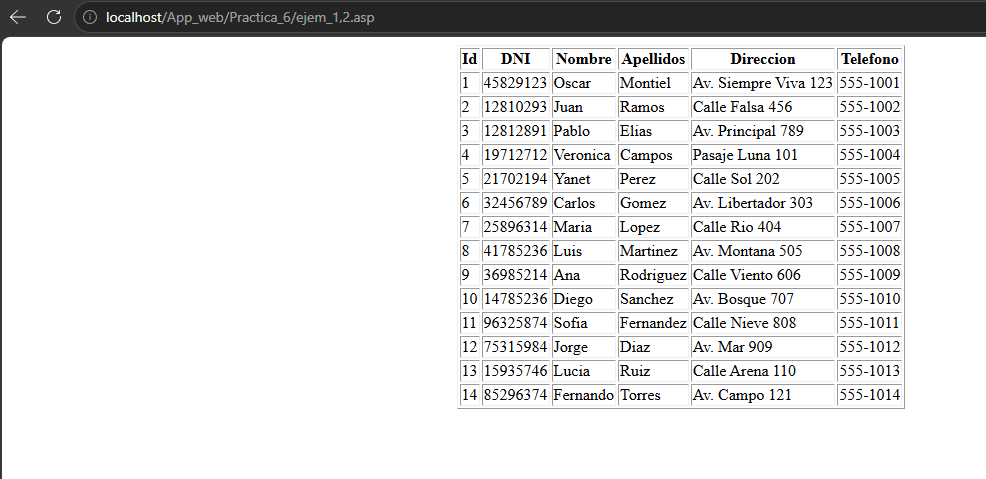

### Pantalla — Ejemplo 3: Lectura con JScript
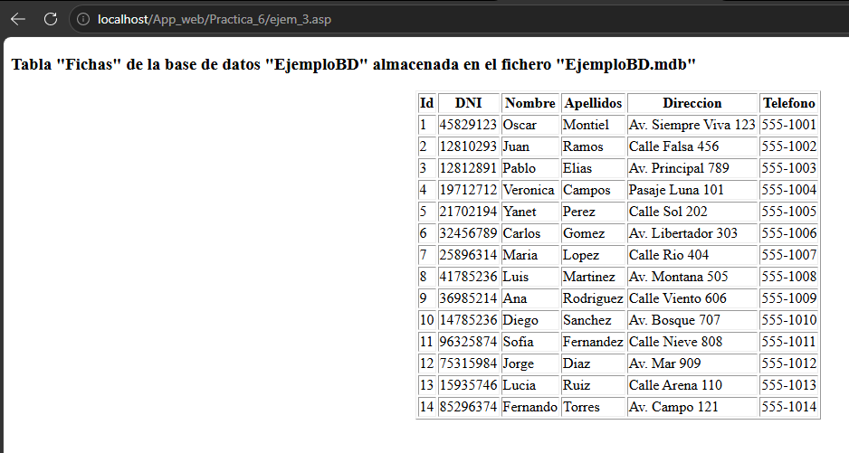

### Pantalla — Ejemplo 4: Buscador por nombre
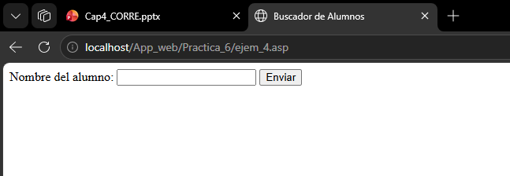
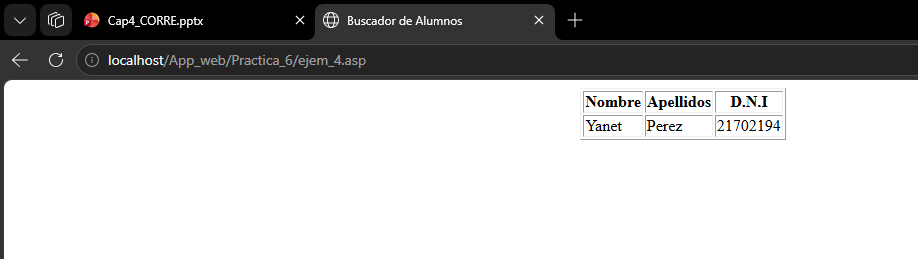

### Pantalla — Ejemplo 5: Buscador en JScript
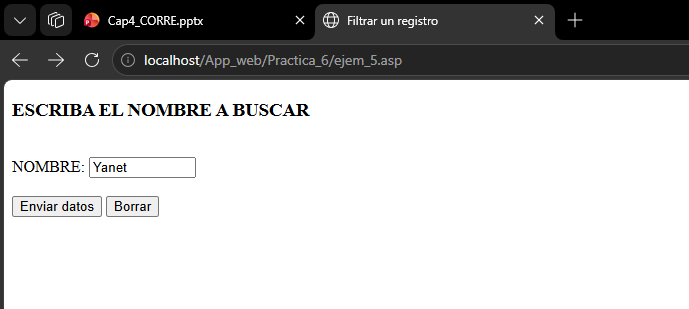
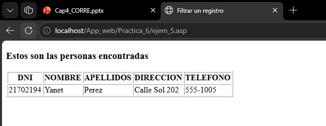

### Pantalla — Ejemplo 6: Paginación con QueryString
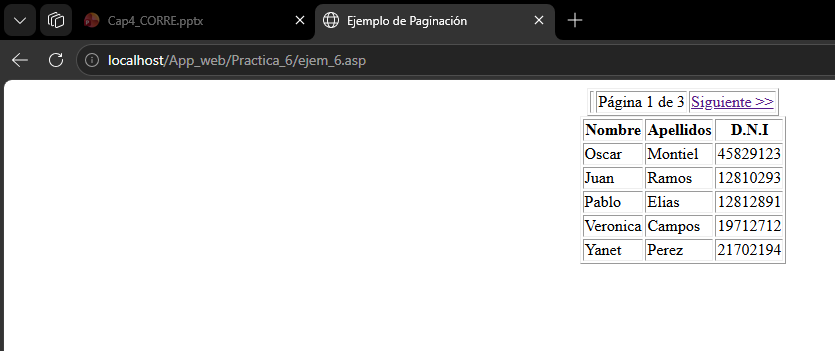
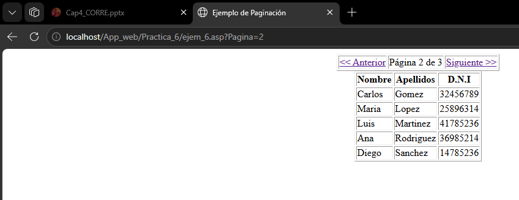
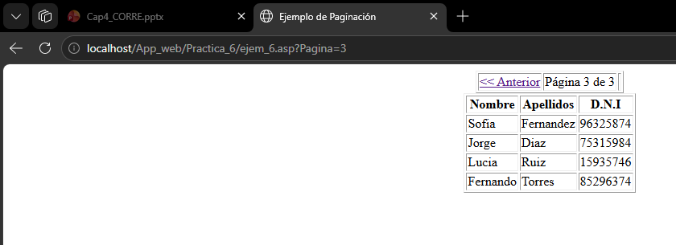

### Pantalla — Ejemplo 7: Paginación con Session
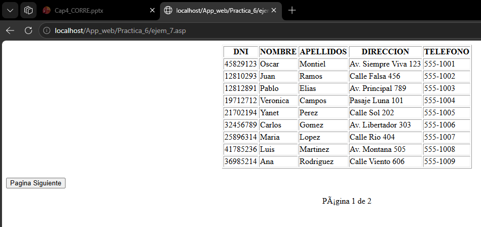
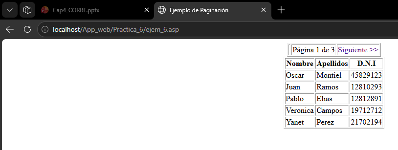
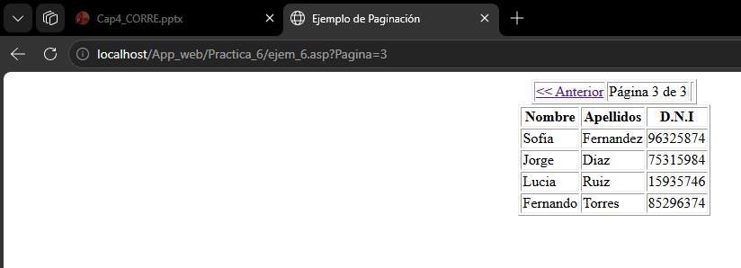

### Pantalla — Ejemplo 8: Insertar (VBScript)


### Pantalla — Ejemplo 9: Insertar (JScript)


### Pantalla — Ejemplo 10: Modificar (VBScript)


### Pantalla — Ejemplo 11: Modificar (JScript)


### Pantalla — Ejemplo 12: Eliminar (VBScript)


### Pantalla — Ejemplo 13: Eliminar (JScript)


---

En esta práctica se ha demostrado cómo ASP Clásico puede implementar las cuatro operaciones fundamentales CRUD (Crear, Leer, Actualizar, Eliminar) sobre una base de datos Microsoft Access mediante ADODB. Se exploraron diferentes técnicas como el uso de DSN vs conexión OLEDB directa, filtros con la propiedad `Filter`, paginación con `PageSize` y `AbsolutePage`, y el uso de ambos lenguajes de scripting (VBScript y JScript). Este conjunto de ejemplos proporciona una base completa para el desarrollo de aplicaciones web dinámicas con acceso a bases de datos desde ASP Clásico.
